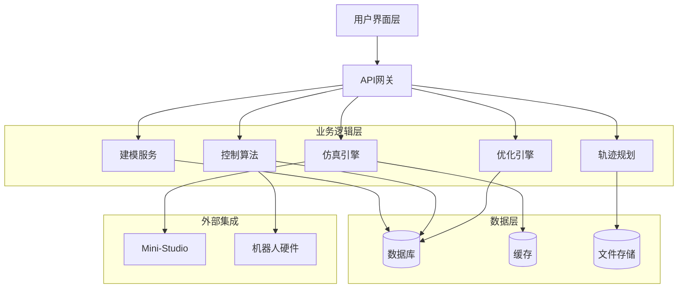

# 设计文档

## 概述

工业机械臂控制算法优化系统是一个集成的软件平台，旨在为国产工业机械臂提供建模、仿真、控制算法实现和参数优化功能。系统采用模块化架构设计，与现有的Mini-Studio组件无缝集成，为工程师提供完整的机械臂控制开发和优化工具链。

系统的核心目标是通过精确的数学建模、高保真仿真环境和智能优化算法，提升国产工业机械臂的控制性能，缩短产品开发周期，降低调试成本。

## 架构

### 系统架构概览

系统采用分层架构设计，包含以下主要层次：

1. **表示层 (Presentation Layer)**: 用户界面和可视化组件
2. **业务逻辑层 (Business Logic Layer)**: 核心算法和控制逻辑
3. **数据访问层 (Data Access Layer)**: 数据管理和持久化
4. **基础设施层 (Infrastructure Layer)**: 系统服务和外部集成

### 核心架构组件



## 组件和接口

### 1. 机械臂建模服务 (RobotModelingService)

负责创建和管理机械臂的数学模型，包括运动学和动力学模型。

**主要接口:**
- `createKinematicModel(robotSpec: RobotSpecification): KinematicModel`
- `createDynamicModel(robotSpec: RobotSpecification): DynamicModel`
- `validateModel(model: RobotModel): ValidationResult`
- `loadRobotFromSTL(filePath: string): RobotGeometry`

**核心功能:**
- DH参数建模
- 雅可比矩阵计算
- 动力学参数识别
- 模型验证和校准
### 2. 仿真引擎 (SimulationEngine)

提供高保真的机械臂仿真环境，支持实时物理仿真和可视化。

**主要接口:**
- `initializeSimulation(model: RobotModel): SimulationContext`
- `stepSimulation(controlInput: ControlCommand): SimulationState`
- `getSimulationState(): RobotState`
- `recordTrajectory(): TrajectoryData`

**核心功能:**
- 物理引擎集成
- 碰撞检测
- 实时渲染
- 传感器仿真

### 3. 控制算法管理器 (ControlAlgorithmManager)

实现和管理多种控制算法，提供统一的控制接口。

**主要接口:**
- `registerAlgorithm(algorithm: ControlAlgorithm): void`
- `selectAlgorithm(algorithmType: AlgorithmType): void`
- `computeControl(state: RobotState, target: Target): ControlCommand`
- `updateParameters(params: AlgorithmParameters): void`

**支持的算法:**
- PID控制器
- 自适应控制
- 模型预测控制 (MPC)
- 滑模控制

### 4. 优化引擎 (OptimizationEngine)

实现多种优化算法，用于控制参数的自动调优。

**主要接口:**
- `defineObjective(objective: ObjectiveFunction): void`
- `setConstraints(constraints: OptimizationConstraints): void`
- `optimize(algorithm: OptimizationAlgorithm): OptimizationResult`
- `getOptimizationProgress(): ProgressInfo`

**优化算法:**
- 遗传算法 (GA)
- 粒子群优化 (PSO)
- 差分进化 (DE)
- 贝叶斯优化

### 5. 轨迹规划器 (TrajectoryPlanner)

生成和优化机械臂运动轨迹。

**主要接口:**
- `planTrajectory(start: Pose, end: Pose): Trajectory`
- `optimizeTrajectory(trajectory: Trajectory, criteria: OptimizationCriteria): Trajectory`
- `validateTrajectory(trajectory: Trajectory): ValidationResult`
- `interpolateTrajectory(waypoints: Pose[]): Trajectory`

**规划算法:**
- 五次多项式插值
- B样条轨迹生成
- 时间最优轨迹规划
- 能耗最优轨迹规划

### 6. 性能监控器 (PerformanceMonitor)

实时监控和评估系统性能指标。

**主要接口:**
- `startMonitoring(): void`
- `recordMetric(metric: PerformanceMetric): void`
- `generateReport(): PerformanceReport`
- `getRealtimeMetrics(): MetricData[]`

**监控指标:**
- 位置精度
- 速度和加速度
- 跟踪误差
- 能耗分析

## 数据模型

### 核心数据结构

#### RobotSpecification
```typescript
interface RobotSpecification {
  name: string;
  dofCount: number;
  dhParameters: DHParameter[];
  jointLimits: JointLimit[];
  dynamicParameters: DynamicParameter[];
  geometryFile: string;
}
```

#### RobotState
```typescript
interface RobotState {
  timestamp: number;
  jointPositions: number[];
  jointVelocities: number[];
  jointAccelerations: number[];
  endEffectorPose: Pose;
  forces: number[];
  torques: number[];
}
```

#### ControlCommand
```typescript
interface ControlCommand {
  timestamp: number;
  commandType: CommandType;
  jointCommands: JointCommand[];
  feedforwardTorques?: number[];
}
```

#### OptimizationResult
```typescript
interface OptimizationResult {
  optimalParameters: AlgorithmParameters;
  objectiveValue: number;
  convergenceHistory: number[];
  iterationCount: number;
  executionTime: number;
  validationMetrics: PerformanceMetric[];
}
```

### 数据存储策略

- **时序数据**: 使用时序数据库存储仿真和实验数据
- **配置数据**: 使用关系数据库存储机器人规格和算法参数
- **大文件**: 使用对象存储管理STL文件和轨迹数据
- **缓存**: 使用内存缓存提高计算性能
## 正确性属性

*属性是一个特征或行为，应该在系统的所有有效执行中保持为真——本质上是关于系统应该做什么的正式陈述。属性作为人类可读规范和机器可验证正确性保证之间的桥梁。*

基于需求分析，以下是系统必须满足的关键正确性属性：

### 属性反思

在编写具体属性之前，我需要识别和消除冗余的属性：

- 属性1（运动学模型创建）和属性2（动力学模型创建）可以合并为一个综合的模型创建属性
- 属性4（仿真状态更新）和属性5（轨迹记录）都涉及仿真数据的正确性，可以合并
- 属性8（时间优化）和属性9（能耗优化）可以合并为轨迹优化的综合属性
- 属性12（数据存储格式）和属性13（元数据包含）可以合并为数据存储完整性属性

### 核心正确性属性

**属性 1: 机械臂模型创建完整性**
*对于任何*有效的机械臂规格参数，系统创建的运动学和动力学模型应当数学上一致且包含所有必要的参数
**验证需求: 需求 1.1, 1.2, 1.4**

**属性 2: 仿真物理约束保持**
*对于任何*控制指令输入，仿真环境中的机械臂状态更新应当始终满足物理约束和关节限制
**验证需求: 需求 2.2, 2.3**

**属性 3: 轨迹数据记录一致性**
*对于任何*仿真运行过程，记录的轨迹数据应当与仿真中的实际机械臂状态完全一致
**验证需求: 需求 2.4**

**属性 4: 控制算法参数配置有效性**
*对于任何*选定的控制算法，用户配置的参数应当在算法的有效参数范围内且能够正确应用
**验证需求: 需求 3.4**

**属性 5: 优化收敛性保证**
*对于任何*优化问题，当优化算法运行时，应当在有限步骤内收敛到局部最优解或报告收敛失败
**验证需求: 需求 4.1, 4.4, 4.5**

**属性 6: 轨迹规划可行性**
*对于任何*有效的起点和终点，生成的运动轨迹应当是物理可行的且满足机械臂的所有约束条件
**验证需求: 需求 6.1, 6.4**

**属性 7: 轨迹优化改进性**
*对于任何*初始轨迹，优化后的轨迹在指定的性能指标（时间或能耗）上应当不劣于原始轨迹
**验证需求: 需求 6.2, 6.3**

**属性 8: 性能监控数据准确性**
*对于任何*机械臂运动状态，监控系统记录的性能指标应当准确反映实际的位置精度、速度和跟踪误差
**验证需求: 需求 5.1, 5.2, 5.3**

**属性 9: 数据存储完整性**
*对于任何*存储的仿真或实验数据，应当包含完整的时间戳、元数据信息，且支持无损的导入导出往返操作
**验证需求: 需求 7.1, 7.2, 7.3**

**属性 10: 用户操作响应性**
*对于任何*用户界面操作，系统应当在合理时间内提供相应的视觉反馈和状态更新
**验证需求: 需求 8.2, 8.3**

## 错误处理

### 错误分类和处理策略

#### 1. 输入验证错误
- **机械臂参数错误**: 验证DH参数、关节限制等的有效性
- **控制指令错误**: 检查控制指令是否超出安全范围
- **轨迹参数错误**: 验证起点终点的可达性

**处理策略**: 输入验证失败时返回详细错误信息，不执行后续操作

#### 2. 计算错误
- **数值计算溢出**: 矩阵运算、微分方程求解中的数值问题
- **优化算法发散**: 优化过程中的收敛失败
- **仿真不稳定**: 物理仿真中的数值不稳定

**处理策略**: 实现数值稳定性检查，提供降级计算方案

#### 3. 系统资源错误
- **内存不足**: 大规模仿真或优化过程中的内存耗尽
- **计算超时**: 长时间运行的优化或仿真任务
- **存储空间不足**: 大量数据存储时的磁盘空间问题

**处理策略**: 实现资源监控和自动清理机制，提供用户警告

#### 4. 外部集成错误
- **Mini-Studio连接失败**: 与现有组件的通信错误
- **硬件连接错误**: 与实际机器人硬件的通信问题
- **文件系统错误**: STL文件读取、数据文件访问错误

**处理策略**: 实现重试机制和降级模式，确保系统核心功能可用

## 测试策略

### 双重测试方法

系统采用单元测试和基于属性的测试相结合的综合测试策略：

**单元测试**:
- 验证具体的算法实现（如PID控制器、遗传算法）
- 测试边界条件和错误情况
- 验证与Mini-Studio组件的集成点
- 测试特定机器人型号（如ER15）的处理

**基于属性的测试**:
- 验证通用的正确性属性，覆盖大量随机输入
- 每个属性测试运行最少100次迭代
- 使用随机生成的机械臂参数、控制指令和轨迹数据
- 验证系统在各种输入条件下的鲁棒性

### 测试配置要求

**基于属性的测试库**: 根据实现语言选择合适的属性测试框架
- Python: Hypothesis
- TypeScript/JavaScript: fast-check
- Java: jqwik
- C++: RapidCheck

**测试标记格式**: 每个属性测试必须包含以下标记注释：
```
Feature: control-algorithm-optimization, Property {number}: {property_text}
```

**测试覆盖率要求**:
- 所有核心算法模块达到90%以上代码覆盖率
- 所有正确性属性都有对应的属性测试实现
- 关键错误处理路径都有相应的单元测试

### 性能测试

除功能测试外，还需要进行以下性能测试：
- **实时性测试**: 验证控制算法的实时响应能力
- **可扩展性测试**: 测试系统处理大规模数据和复杂模型的能力
- **稳定性测试**: 长时间运行的稳定性和内存泄漏检测
- **并发测试**: 多用户同时使用系统的性能表现