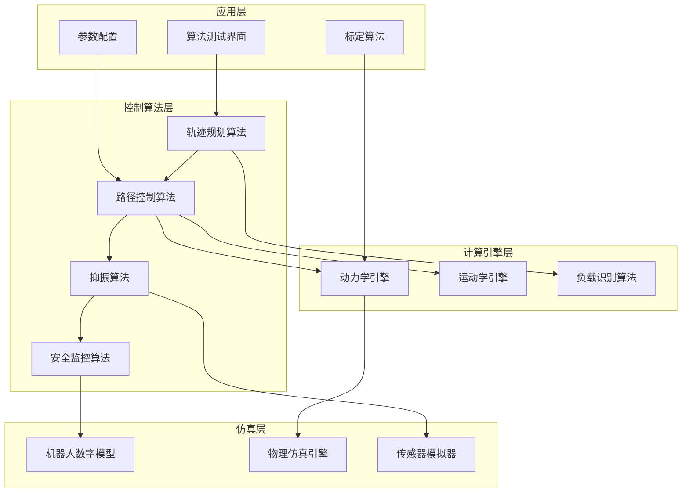

# 机器人运动控制系统设计文档

## 概述

本设计文档描述了一套对标ABB QuickMove、TrueMove并加入StableMove功能的机器人运动控制算法库。系统专注于控制算法开发，采用分层架构，实现从运动学控制向全动力学控制的跨越，提供高精度、高速度、低振动的机器人运动控制算法。

系统核心特性：
- 高精度路径跟踪算法（≤0.1mm偏差）
- 时间最优轨迹规划算法（TOPP）
- 主动振动抑制算法（输入整形技术）
- 全动力学建模与补偿算法
- 数字化机器人仿真模型

## 架构

### 系统整体架构



### 控制算法架构

系统采用多层级控制算法架构，从上到下分为：

1. **任务规划层**：处理高级运动指令，生成路径点序列
2. **轨迹规划层**：实现TOPP算法，生成时间最优轨迹
3. **路径控制层**：高精度路径跟踪，前馈+反馈控制算法
4. **抑振控制层**：输入整形和柔性补偿算法
5. **仿真验证层**：数字化机器人模型验证算法效果

## 组件和接口

### 核心组件

#### 1. 轨迹规划器 (Trajectory Planner)

**功能**：
- 实现时间最优路径参数化（TOPP）算法
- 自适应包络线调整
- 七段式S型插补
- 负载自适应优化

**接口**：
```cpp
class TrajectoryPlanner {
public:
    // 生成时间最优轨迹
    Trajectory generateTOPP(const Path& path, 
                           const KinodynamicLimits& limits,
                           const PayloadInfo& payload);
    
    // 自适应包络线调整
    void adaptEnvelope(const SystemState& state);
    
    // S型插补
    Trajectory interpolateS7(const std::vector<Waypoint>& waypoints);
};
```

#### 2. 路径控制器 (Path Controller)

**功能**：
- 高精度路径跟踪
- 前馈控制补偿
- 动力学模型预测
- 误差补偿算法

**接口**：
```cpp
class PathController {
public:
    // 计算控制指令
    ControlCommand computeControl(const TrajectoryPoint& reference,
                                 const RobotState& current_state);
    
    // 前馈控制
    ControlCommand feedforwardControl(const TrajectoryPoint& reference);
    
    // 反馈控制
    ControlCommand feedbackControl(const Vector& error);
};
```

#### 3. 抑振控制器 (Vibration Suppressor)

**功能**：
- 输入整形滤波器
- 柔性关节补偿
- 末端反馈控制
- 自适应参数调整

**接口**：
```cpp
class VibrationSuppressor {
public:
    // 输入整形
    ControlCommand applyInputShaping(const ControlCommand& input);
    
    // 柔性关节补偿
    void compensateFlexibleJoints(ControlCommand& command);
    
    // 末端反馈补偿
    void applyEndEffectorFeedback(const SensorData& feedback);
};
```

#### 4. 动力学引擎 (Dynamics Engine)

**功能**：
- 正向/逆向动力学计算
- 雅可比矩阵计算
- 重力补偿
- 摩擦力建模

**接口**：
```cpp
class DynamicsEngine {
public:
    // 正向动力学
    Vector forwardDynamics(const Vector& q, const Vector& qd, 
                          const Vector& tau);
    
    // 逆向动力学
    Vector inverseDynamics(const Vector& q, const Vector& qd, 
                          const Vector& qdd);
    
    // 雅可比矩阵
    Matrix jacobian(const Vector& q);
    
    // 重力补偿
    Vector gravityCompensation(const Vector& q);
};
```

#### 5. 负载识别算法 (Payload Identifier)

**功能**：
- 在线负载参数识别算法
- 惯性参数估计算法
- 自适应模型更新算法
- 参数验证算法

**接口**：
```cpp
class PayloadIdentifier {
public:
    // 负载识别算法
    PayloadInfo identifyPayload(const MotionData& motion_data);
    
    // 参数更新算法
    void updateParameters(const PayloadInfo& payload);
    
    // 验证识别结果
    bool validateIdentification(const PayloadInfo& payload);
};
```

#### 6. 机器人数字模型 (Robot Digital Model)

**功能**：
- 完整的机器人动力学仿真
- 关节摩擦和柔性建模
- 传感器噪声模拟
- 物理特性参数化

**接口**：
```cpp
class RobotDigitalModel {
public:
    // 仿真步进
    RobotState simulateStep(const ControlCommand& command, double dt);
    
    // 设置机器人参数
    void setRobotParameters(const RobotParameters& params);
    
    // 添加噪声和干扰
    void addNoise(const NoiseConfig& noise);
    
    // 获取传感器数据
    SensorData getSensorData() const;
};
```

### 算法接口

#### 仿真环境接口

```cpp
class SimulationEnvironment {
public:
    // 初始化仿真环境
    bool initialize(const SimulationConfig& config);
    
    // 运行仿真步骤
    void runSimulationStep(double dt);
    
    // 获取仿真状态
    SimulationState getSimulationState() const;
    
    // 重置仿真
    void resetSimulation();
};
```

## 数据模型

### 核心数据结构

#### 机器人状态
```cpp
struct RobotState {
    Vector joint_positions;      // 关节位置 [rad]
    Vector joint_velocities;     // 关节速度 [rad/s]
    Vector joint_accelerations;  // 关节加速度 [rad/s²]
    Vector joint_torques;        // 关节力矩 [Nm]
    Pose end_effector_pose;      // 末端位姿
    double timestamp;            // 时间戳 [s]
};
```

#### 轨迹点
```cpp
struct TrajectoryPoint {
    Vector position;             // 位置
    Vector velocity;             // 速度
    Vector acceleration;         // 加速度
    Vector jerk;                 // 加加速度
    double time;                 // 时间
    double path_parameter;       // 路径参数
};
```

#### 动力学参数
```cpp
struct DynamicsParameters {
    std::vector<double> masses;          // 连杆质量 [kg]
    std::vector<Vector3> centers_of_mass; // 质心位置 [m]
    std::vector<Matrix3> inertias;       // 惯量张量 [kg⋅m²]
    std::vector<double> friction_coeffs; // 摩擦系数
    Vector gravity;                      // 重力向量 [m/s²]
};
```

#### 负载信息
```cpp
struct PayloadInfo {
    double mass;                 // 负载质量 [kg]
    Vector3 center_of_mass;      // 负载质心 [m]
    Matrix3 inertia;             // 负载惯量张量 [kg⋅m²]
    double identification_confidence; // 识别置信度 [0-1]
};
```

#### 控制限制
```cpp
struct KinodynamicLimits {
    Vector max_joint_positions;     // 最大关节位置 [rad]
    Vector min_joint_positions;     // 最小关节位置 [rad]
    Vector max_joint_velocities;    // 最大关节速度 [rad/s]
    Vector max_joint_accelerations; // 最大关节加速度 [rad/s²]
    Vector max_joint_jerks;         // 最大关节加加速度 [rad/s³]
    Vector max_joint_torques;       // 最大关节力矩 [Nm]
};
```

### 配置数据模型

#### 仿真配置
```cpp
struct SimulationConfig {
    RobotModel robot_model;          // 机器人模型
    ControllerConfig controller;     // 控制器配置
    NoiseConfig noise;               // 噪声配置
    PhysicsConfig physics;           // 物理仿真配置
    CalibrationData calibration;     // 标定数据
};
```

#### 控制器配置
```cpp
struct ControllerConfig {
    double control_frequency;        // 控制频率 [Hz]
    PIDGains position_gains;         // 位置环PID参数
    PIDGains velocity_gains;         // 速度环PID参数
    InputShaperConfig input_shaper;  // 输入整形配置
    TOPPConfig topp_config;          // TOPP算法配置
};
```
## 正确性属性

*属性是一种特征或行为，应该在系统的所有有效执行中保持为真——本质上是关于系统应该做什么的正式陈述。属性作为人类可读规范和机器可验证正确性保证之间的桥梁。*

基于需求分析，以下是系统的核心正确性属性：

### 属性1：轨迹跟踪精度与速度无关性
*对于任意*编程轨迹和任意执行速度，末端实际轨迹与编程轨迹的偏差应始终在0.1mm以内，且精度不受速度变化影响
**验证需求：需求1.1, 1.2**

### 属性2：轨迹平滑性
*对于任意*生成的轨迹，其位置、速度、加速度应连续且可微，确保运动平滑无突变
**验证需求：需求1.5**

### 属性3：安全限制遵守与速度最优化
*对于任意*运动任务，生成的轨迹应严格遵守电机和减速机的安全限制，同时在这些限制内实现最大运动速度
**验证需求：需求2.2**

### 属性4：负载自适应识别
*对于任意*负载变化，系统应能正确识别新的负载参数并相应调整控制策略
**验证需求：需求2.4**

### 属性5：负载识别时间性能
*对于任意*负载变化事件，系统应在3秒内完成负载重新识别和参数调整
**验证需求：需求2.5**

### 属性6：振动抑制效果
*对于任意*高速启停动作，系统应将振动幅度控制在0.05mm以内
**验证需求：需求3.1**

### 属性7：算法计算性能
*对于任意*控制算法计算，系统应在指定的计算时间预算内完成所有算法计算
**验证需求：需求4.2, 4.4**

### 属性8：动力学计算正确性
*对于任意*机器人配置和状态，动力学引擎的正向动力学、逆向动力学和雅可比矩阵计算应满足物理一致性
**验证需求：需求5.2**

### 属性9：配置变化自适应
*对于任意*机器人配置变化，动力学引擎应自动重新计算并更新相应的动力学参数
**验证需求：需求5.3**

### 属性10：仿真模型一致性
*对于任意*控制指令，数字化机器人模型的响应应与真实物理系统保持一致
**验证需求：需求6.2**

### 属性11：算法故障检测
*对于任意*算法计算异常或数值不稳定情况，系统应能检测并报告异常
**验证需求：需求6.4**

### 属性12：安全算法响应
*对于任意*检测到的异常运动或超限情况，安全监控算法应及时触发保护措施
**验证需求：需求7.2**

### 属性13：碰撞检测算法准确性
*对于任意*潜在碰撞情况，碰撞检测算法应准确识别并触发相应的避让策略
**验证需求：需求7.4**

## 错误处理

### 错误分类

#### 1. 算法计算异常
- **轨迹规划失败**：无法生成可行轨迹
- **动力学计算异常**：数值不稳定或奇异性
- **控制器饱和**：控制输出超出限制

**处理策略**：
- 回退到安全轨迹算法
- 降低运动速度和加速度参数
- 启用备用控制算法
- 实时参数自适应调整

#### 2. 数值计算问题
- **矩阵奇异性**：雅可比矩阵或惯性矩阵奇异
- **数值溢出**：计算结果超出数值范围
- **收敛失败**：迭代算法无法收敛

**处理策略**：
- 使用数值稳定的算法变体
- 实施奇异性检测和处理
- 添加正则化项提高数值稳定性
- 设置合理的收敛阈值和最大迭代次数

#### 3. 模型参数异常
- **负载参数错误**：识别的负载参数不合理
- **机器人参数漂移**：模型参数与实际不符
- **标定数据异常**：标定结果存在明显错误

**处理策略**：
- 参数合理性检查和验证
- 渐进式参数更新策略
- 多重验证机制
- 参数异常检测和报警

#### 4. 算法性能问题
- **计算时间超限**：算法执行时间过长
- **内存使用异常**：内存占用超出预期
- **算法收敛慢**：优化算法收敛速度慢

**处理策略**：
- 动态调整算法复杂度
- 实施计算资源监控
- 使用近似算法加速计算
- 优化数据结构和算法实现

### 错误恢复机制

#### 自动恢复
```cpp
class AlgorithmRecoveryManager {
public:
    // 算法异常检测和分类
    ErrorType detectAlgorithmError(const ComputationState& state);
    
    // 自动恢复策略
    RecoveryAction planRecovery(ErrorType error);
    
    // 执行恢复动作
    bool executeRecovery(const RecoveryAction& action);
    
    // 验证恢复效果
    bool verifyRecovery(const ComputationState& state);
};
```

#### 算法监控接口
- 提供算法性能监控
- 支持参数在线调整
- 允许算法切换和降级
- 提供计算状态诊断工具

## 测试策略

### 双重测试方法

系统采用单元测试和基于属性的测试相结合的综合测试策略：

#### 单元测试
- **具体示例验证**：测试特定场景下的系统行为
- **边界条件测试**：验证极限情况下的系统响应
- **错误条件测试**：确保异常情况得到正确处理
- **集成点测试**：验证组件间的接口和交互

#### 基于属性的测试
- **通用属性验证**：通过随机化输入验证系统的通用属性
- **全面输入覆盖**：通过随机化实现广泛的输入空间覆盖
- **最少100次迭代**：每个属性测试运行至少100次以确保统计显著性
- **属性标记格式**：**功能：robot-motion-control，属性{编号}：{属性文本}**

### 测试配置

#### 基于属性的测试库选择
- **C++环境**：使用RapidCheck或Catch2的生成器
- **Python环境**：使用Hypothesis库
- **测试迭代次数**：每个属性测试最少100次迭代
- **随机种子管理**：支持可重现的测试结果

#### 测试环境要求
- **算法测试环境**：配置高性能计算环境
- **仿真测试环境**：集成数字化机器人模型
- **数值稳定性测试**：专用的数值计算测试套件
- **性能基准测试**：算法性能评估工具

#### 测试数据生成
- **轨迹生成器**：生成各种复杂度的测试轨迹
- **负载模拟器**：模拟不同质量和惯性的负载
- **噪声注入器**：模拟各种传感器噪声和干扰
- **参数扰动器**：测试算法对参数变化的鲁棒性

### 持续集成测试

#### 自动化测试流水线
- **代码提交触发**：每次代码提交自动运行测试套件
- **夜间完整测试**：运行完整的属性测试套件
- **性能回归测试**：监控算法性能指标变化
- **数值稳定性测试**：在不同数值条件下验证算法稳定性

#### 测试报告和监控
- **实时测试状态**：提供测试执行状态的实时监控
- **性能趋势分析**：跟踪关键算法性能指标的长期趋势
- **算法失效模式分析**：分析和分类算法失败模式
- **覆盖率报告**：代码覆盖率和算法路径覆盖率分析